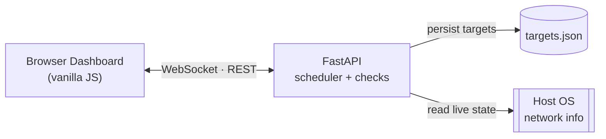

<div align="center">


# TingPing

**A self-hosted, real-time network monitoring dashboard — no database, no cloud, no bill.**

[](LICENSE)
[](https://www.python.org/)
[](https://fastapi.tiangolo.com/)

</div>

---

TingPing watches the hosts and services you care about — ping, TCP, HTTP, DNS — and streams the results live to your browser over WebSockets. It also shows a real-time snapshot of the machine it's running on: active adapter, gateway, DNS, Wi‑Fi, and public IP.

Everything runs as a single Python process with a static, framework-free frontend.

## Who it's for

| Role | What TingPing gives you |
|---|---|
| **Sysadmins** | Live status for internal servers and services, without standing up a full monitoring stack |
| **Network admins** | Continuous checks on gateways, resolvers, and critical ports, plus a live view of the local network's own health |
| **Homelabbers & self-hosters** | A lightweight watchdog for a NAS, Pi cluster, or home server |
| **Small IT teams / freelancers** | Monitor a handful of client sites without per-monitor SaaS pricing |

## Why it matters

- 🔍 **Instant visibility** — one dashboard shows what's up, down, or slow, no log-diving required
- 🔒 **No SaaS, no telemetry** — nothing leaves your network except one optional public-IP lookup you can disable
- ⚡ **Zero setup overhead** — one process, no database, nothing to install on the machines you're watching
- 🖥️ **Built-in self-diagnostics** — the device panel answers "is it my network or theirs?" in one click
- 💾 **Privacy by design** — only target configs touch disk; check history lives in memory and vanishes on restart

## Features

- Live dashboard — add unlimited targets, each polled on its own interval, updated instantly for every open tab
- Four check types — **Ping**, **TCP**, **HTTP(S)**, **DNS**
- Human-readable failure detail — timeouts, refused connections, TLS failures, DNS errors, and more, in plain language
- Uptime ratio + latency sparkline per target, from a rolling in-memory history
- Drag-and-drop reordering that persists across restarts
- Device status panel — interface, IP, DHCP, DNS, Wi‑Fi, traffic, gateway/internet reachability, public IP, and a VPN/proxy heuristic
- Cross-platform — Windows and Linux/macOS

## Quick start

```bash
git clone <this-repo-url>
cd ting-ping

python -m venv .venv
# Windows: .venv\Scripts\activate   |   Linux/macOS: source .venv/bin/activate

pip install -r requirements.txt
cp .env.example .env   # Windows: copy .env.example .env

python run.py
```

Open **http://127.0.0.1:8420**, click **Add monitor**, and watch it go live.

Platform launchers are also included: `run_windows.ps1` / `.bat` on Windows, `run_linux.sh` on Linux/macOS.

## How it's built



- **Backend (FastAPI)** — a `TargetScheduler` runs one `asyncio` loop per target: check → buffer the result → broadcast over WebSocket → sleep → repeat. Each check type is its own module that translates OS-level errors into a fixed, readable status vocabulary.
- **Frontend** — plain HTML/CSS/JS, no build step, no framework. A single WebSocket connection keeps every card, sparkline, and the device panel live.
- **Storage** — target definitions are the only thing persisted, written atomically to `data/targets.json`. Everything else — check history, device snapshots — lives in memory only.

## Configuration

All settings are environment variables, loaded from `.env` (see `.env.example`). Common ones:

| Variable | Default | Purpose |
|---|---|---|
| `TP_HOST` / `TP_PORT` | `127.0.0.1` / `8420` | Where the server listens |
| `TP_BUFFER_SIZE` | `60` | Results kept per target |
| `TP_DEFAULT_INTERVAL_S` | `5` | Default polling interval |
| `TP_PUBLIC_IP_LOOKUP` | `1` | Set to `0` to disable the one outbound call TingPing makes on its own |

Timeouts per check type, interval bounds, and probe targets are also configurable — see `.env.example` for the full list.

## License

MIT — see [LICENSE](LICENSE).
