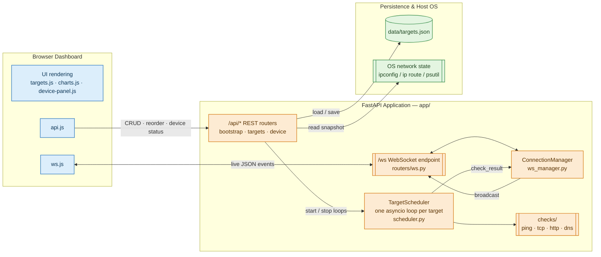
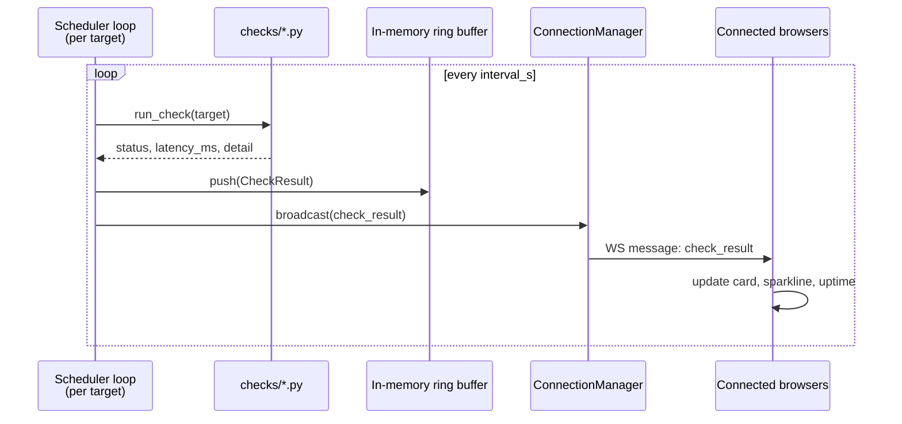

<p align="center">
  
</p>

<h1 align="center">TingPing</h1>

<p align="center">Built by Dwaipayan Datta</p>

TingPing is a self-hosted, real-time network monitoring dashboard. It periodically checks the hosts and services you care about (ping, TCP port, HTTP, DNS), streams the results to a live browser dashboard over WebSockets, and gives you a snapshot of your own machine's network state — active adapter, gateway, DNS, Wi‑Fi, traffic counters, and public IP.

Everything runs locally as a single Python process with a static HTML/CSS/JS frontend — no database, no external services required (public IP lookup is the one optional exception).

## Features

- **Live monitoring dashboard** — add any number of monitors ("targets"), each polled on its own interval, with results pushed to every connected browser tab over a WebSocket the instant a check completes.
- **Four check methods**
  - **Ping** (ICMP via the OS `ping` command)
  - **TCP** — attempts a raw connection to `host:port`
  - **HTTP(S)** — GETs a URL and inspects the status code
  - **DNS** — resolves a hostname via `getaddrinfo`
- **Rich, human-readable failure classification** — every check result is mapped to a fixed vocabulary of outcomes (timeout, destination unreachable, connection refused, TLS handshake failed, DNS failure, network unreachable, HTTP error, permission denied, etc.) instead of a raw exception dump, so a failure reads the way a real network tool would describe it.
- **Uptime & latency history** — each target keeps a rolling in-memory buffer of its most recent results (configurable size) used to compute an uptime ratio and render a latency sparkline. Nothing is written to disk beyond the buffer size — see [Data & privacy](#data--privacy).
- **Drag-and-drop dashboard** — reorder monitor cards; order is persisted and survives a restart.
- **Device status panel** — a snapshot of the machine TingPing runs on: hostname/OS/uptime, active network interface (name, MAC, link speed, duplex), IPv4/IPv6 addresses, DHCP lease info, DNS servers + a live resolver test, Wi‑Fi details (SSID, signal, band, channel) when applicable, live traffic throughput, gateway/internet reachability probes, public IP/ISP/location lookup, and a heuristic VPN-or-proxy indicator.
- **No database** — target definitions live in a small JSON file; everything else is in memory.
- **Cross-platform** — works on Windows and POSIX systems (Linux/macOS), with OS-appropriate `ping`/`ipconfig`/`ip route` parsing.

## How it works

### Backend (FastAPI)

- **`app/scheduler.py`** — a `TargetScheduler` owns one `asyncio` task per enabled target. Each task loops forever: run the check → push the result into that target's in-memory ring buffer → broadcast it to all connected WebSocket clients → sleep for the target's configured interval. Adding, editing, deleting, or disabling a target starts/stops its task without touching the others.
- **`app/checks/`** — one module per check method (`ping.py`, `tcp.py`, `http.py`, `dns.py`), each returning a `(status, latency_ms, detail)` tuple. `base.py` dispatches to the right one and catches anything a check itself didn't classify, so a target can never crash its scheduler loop. `status.py` defines the fixed status vocabulary (`CheckStatus`) and maps OS-level errors (`errno`, `socket.gaierror`, `ConnectionRefusedError`, TLS errors, etc.) onto it.
- **`app/models.py`** — `Target` (persisted config: host, method, interval, per-method options, dashboard position) and `TargetState` (the runtime-only `deque` ring buffer of `CheckResult`s — this is what makes "no history" true: results live only as long as the process does).
- **`app/storage.py`** — atomically reads/writes `data/targets.json` (write-to-temp-then-replace), keeping each target's dashboard position in sync with list order.
- **`app/device_status.py`** — builds the device panel by parsing the real output of `ipconfig /all` (Windows) or `ip route` / `/etc/resolv.conf` (POSIX), cross-referencing it with `psutil` for adapter stats and traffic counters, probing the gateway and a public internet host over TCP, and optionally calling an external IP-info API for the public-identity block.
- **`app/ws_manager.py`** — a small connection registry that broadcasts JSON messages to every open WebSocket and prunes dead connections.
- **`app/routers/`** — the HTTP/WebSocket surface (see [API](#api-reference) below).
- **`app/main.py`** — wires it all together: on startup it loads targets from disk and starts their check loops; on shutdown it cancels all loops and closes the shared HTTP client cleanly.

### Frontend (static/)

Plain HTML/CSS/JS, no build step or framework:

- `js/ws.js` — opens the WebSocket connection and reconnects on drop.
- `js/api.js` — thin wrapper around the REST endpoints.
- `js/targets.js` — renders the monitor grid, handles the add/edit/delete/reorder UI and drag-and-drop.
- `js/charts.js` — draws the per-target latency sparklines from the result buffer.
- `js/device-panel.js` — renders the device-status panel.
- `js/main.js` — bootstraps the page: fetches initial state, wires up the WebSocket message handlers that keep the dashboard live.

### Architecture diagram



### Live check cycle



## Getting started

### Prerequisites

- Python 3.10+ (developed/tested on 3.14)
- On Linux, ICMP ping may require the `ping` binary to be present and permitted (some distros need `CAP_NET_RAW` or run `ping` setuid — the ping check falls back to a clear "permission denied" status if not).

### Install

```bash
git clone <this-repo-url>
cd ting-ping

python -m venv .venv
# Windows: .venv\Scripts\activate
# Linux/macOS: source .venv/bin/activate

pip install -r requirements.txt

cp .env.example .env   # Windows: copy .env.example .env
```

Edit `.env` if you want to change the port, polling limits, timeouts, or disable the public IP lookup.

### Run

```bash
python run.py
```

Or use the platform launcher scripts, which create/activate the venv path for you (the venv itself must already exist):

- Windows: double-click `run_windows.bat`, or `.\run_windows.ps1`
- Linux/macOS: `./run_linux.sh`

Then open **http://127.0.0.1:8420** (or whatever `TP_HOST`/`TP_PORT` you configured).

### Using the dashboard

1. Click **Add monitor**, give it a name (optional — it defaults to the host), a host/URL, a check method, and an interval.
2. For **TCP** monitors, a port is required. For **HTTP** monitors, you can optionally set a path and scheme (defaults to `https`).
3. The card updates live as results stream in over the WebSocket — latency sparkline, current status, and rolling uptime percentage.
4. Drag cards to reorder them; the order is saved automatically.
5. Toggle a monitor off to pause its check loop without deleting it.
6. Open the device panel to see this machine's live network state, refreshed on demand.

## Configuration

All configuration is via environment variables (see `.env.example`), loaded with `python-dotenv`.

| Variable | Default | Description |
|---|---|---|
| `TP_HOST` | `127.0.0.1` | Interface the server binds to |
| `TP_PORT` | `8420` | Port the server listens on |
| `TP_TARGETS_FILE` | `data/targets.json` | Where target definitions are persisted |
| `TP_STATIC_DIR` | `static` | Frontend assets directory |
| `TP_BUFFER_SIZE` | `60` | Results kept per target's in-memory ring buffer |
| `TP_INTERVAL_MIN_S` / `TP_INTERVAL_MAX_S` | `1` / `60` | Allowed range for a target's polling interval |
| `TP_DEFAULT_INTERVAL_S` | `5` | Suggested default interval sent to the UI |
| `TP_CHECK_TIMEOUT_S` | `3.0` | Generic per-check timeout fallback |
| `TP_PING_TIMEOUT_S` | `2.0` | Ping check timeout |
| `TP_HTTP_TIMEOUT_S` | `5.0` | HTTP check timeout |
| `TP_TCP_TIMEOUT_S` | `3.0` | TCP connect timeout |
| `TP_DNS_TIMEOUT_S` | `3.0` | DNS resolution timeout |
| `TP_DEFAULT_HTTP_SCHEME` | `https` | Scheme used when an HTTP target doesn't specify one |
| `TP_DNS_PROBE_HOST` | `example.com` | Host used for the device panel's DNS resolver test |
| `TP_GATEWAY_PROBE_PORT` | `80` | Port used to test default-gateway reachability |
| `TP_INTERNET_PROBE_HOST` / `TP_INTERNET_PROBE_PORT` | `1.1.1.1` / `443` | Host:port used to test general internet reachability |
| `TP_PUBLIC_IP_LOOKUP` | `1` | Set to `0` to disable the only outbound call this app makes on its own behalf |
| `TP_PUBLIC_IP_URL` | `https://ipinfo.io/json` | Public IP/geolocation lookup endpoint |
| `TP_PUBLIC_IP_TIMEOUT_S` | `4.0` | Timeout for the public IP lookup |
| `TP_LOG_LEVEL` | `INFO` | Python logging level |

## API reference

All REST endpoints are prefixed with `/api`.

| Method | Path | Description |
|---|---|---|
| `GET` | `/api/state` | Full bootstrap payload: all targets with their result buffers, configured interval/buffer limits, and the status-code catalog |
| `GET` | `/api/targets` | List all targets |
| `POST` | `/api/targets` | Create a target |
| `PUT` | `/api/targets/{id}` | Update a target (position is preserved) |
| `DELETE` | `/api/targets/{id}` | Delete a target |
| `PUT` | `/api/targets/order` | Persist a new dashboard order (`{"order": [id, ...]}`) |
| `GET` | `/api/device-status` | Read-only device-status snapshot (not broadcast) |
| `POST` | `/api/device-status` | Recompute device status and broadcast it to all clients |
| `GET` | `/ws` | WebSocket endpoint for live updates |

### Target payload

```json
{
  "name": "My server",
  "host": "example.com",
  "method": "http",
  "interval_s": 5,
  "enabled": true,
  "tcp_port": null,
  "http_path": "/",
  "http_scheme": "https"
}
```

`method` is one of `ping`, `tcp`, `http`, `dns`. `tcp_port` is required when `method` is `tcp`.

### WebSocket messages (server → client)

| `type` | Payload |
|---|---|
| `check_result` | `{ target_id, result, uptime_ratio }` — pushed every time a target's check loop completes |
| `target_added` / `target_updated` | `{ target }` |
| `target_removed` | `{ target_id }` |
| `targets_reordered` | `{ order: [id, ...] }` |
| `device_status` | `{ data }` — broadcast when any client triggers `POST /api/device-status` |

## Data & privacy

- Target *definitions* (name, host, method, interval, position) are the only thing persisted, in `data/targets.json`.
- Check *results* live only in memory, in a fixed-size ring buffer per target (`TP_BUFFER_SIZE`, default 60). Nothing beyond that window is kept — restart the server and history is gone by design.
- The only request TingPing makes to a third party on its own is the public-IP/geolocation lookup used by the device panel (`TP_PUBLIC_IP_URL`, default `ipinfo.io`). Set `TP_PUBLIC_IP_LOOKUP=0` to disable it entirely and keep every request inside your own network.

## Project structure

```
app/
  checks/          ping, tcp, http, dns probes + shared status vocabulary
  routers/         bootstrap, targets, device, websocket endpoints
  config.py        environment-driven settings
  device_status.py OS network-state introspection
  main.py          FastAPI app factory + lifespan (startup/shutdown)
  models.py        Target / CheckResult / TargetState
  scheduler.py      per-target asyncio check loops
  storage.py        JSON persistence for targets
  ws_manager.py      WebSocket broadcast registry
static/            HTML/CSS/vanilla JS dashboard
data/targets.json  persisted target definitions (gitignored)
run.py             entry point (uvicorn)
run_windows.ps1/.bat, run_linux.sh   convenience launchers
```

## License

MIT — see [LICENSE](LICENSE).
